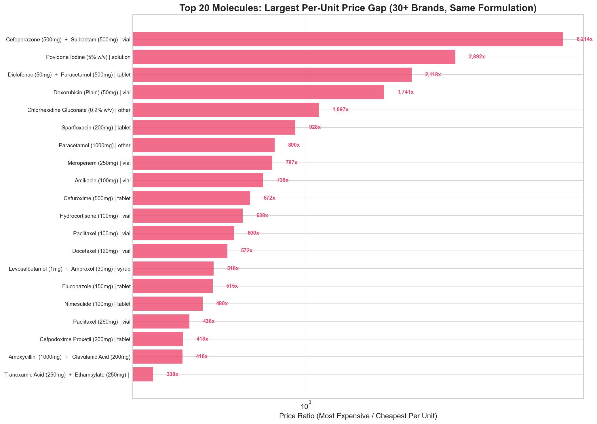
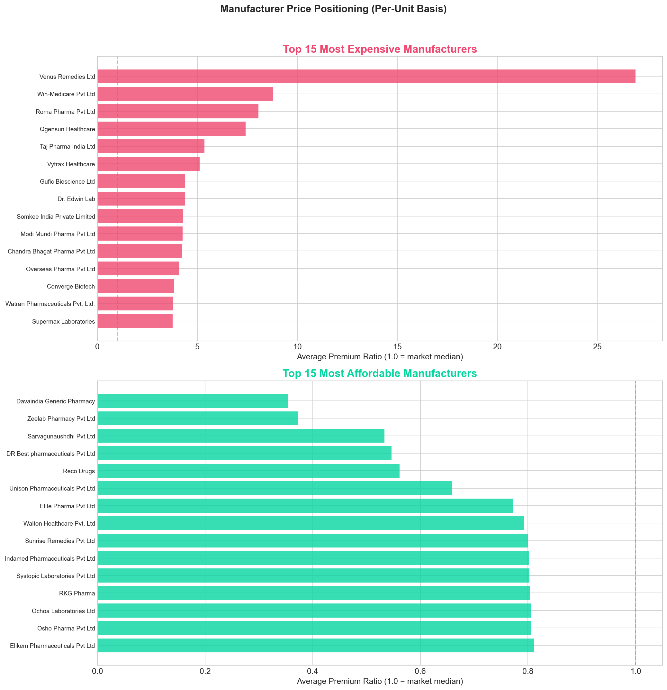
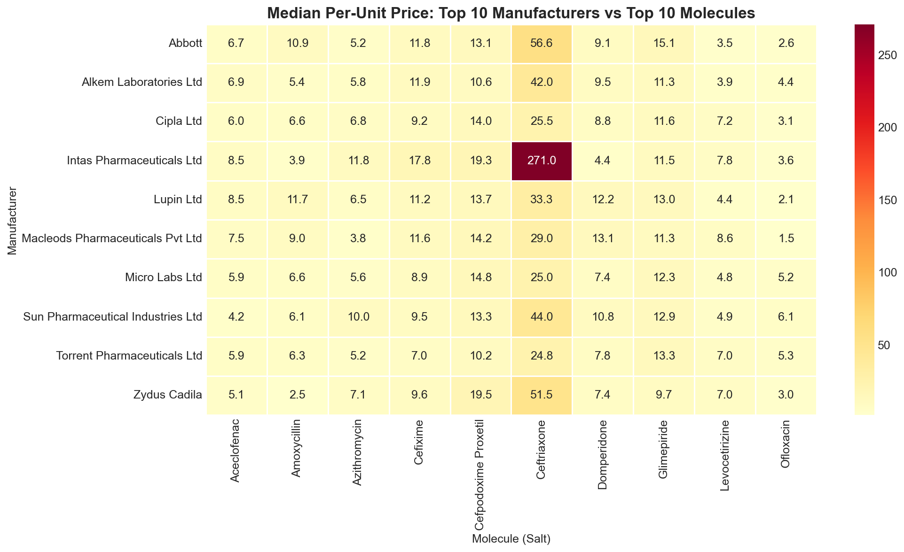
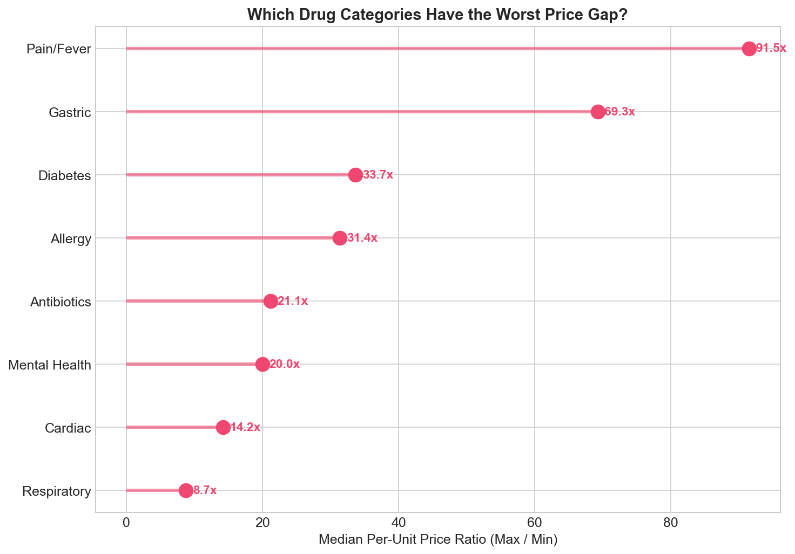

# 💊 India's Medicine Price Gap Analyzer

**If two medicines contain the exact same molecule, why does one cost ₹0.33 and the other ₹23.80?**

An Exploratory Data Analysis of **253,973 Indian medicines** investigating the branded vs generic price gap — revealing that 82% of medicines cost 2x+ more per unit than the cheapest available alternative.



---

## 📊 Key Findings

| Finding | Detail |
|---------|--------|
| **Median price gap** | 4.2x across all compositions with 5+ brands |
| **Worst category** | Pain/Fever drugs have a 91.5x median gap |
| **Competition paradox** | More brands = *wider* price gaps, not smaller (43.7x for 500+ brands vs 2.8x for 5-10) |
| **Most overpriced manufacturer** | Venus Remedies Ltd charges 26.9x the market median |
| **Most affordable manufacturer** | Davaindia Generic Pharmacy at 0.3x the median |
| **Most expensive medicine** | Imbruvica 140mg Capsule (cancer) at ₹4,36,000 |
| **Actionable savings** | Switching to generics for 10 common medicines saves ₹23–₹219 per unit |

---

## 🔬 Methodology

This isn't a generic Kaggle EDA — it uses rigorous analytical decisions:

- **Price-per-unit normalization** — Raw MRP comparison is misleading. A ₹100 strip of 10 tablets and a ₹50 strip of 5 have the same per-unit cost. All comparisons use `price_per_unit`.
- **Outlier investigation, not deletion** — 245 medicines above the 99.9th percentile were inspected and flagged. A ₹4.36L cancer drug isn't a data error.
- **Same-formulation comparison** — Prices are compared within the same formulation type (tablet vs tablet, not tablet vs injection) to avoid misleading ratios.
- **Combination drug analysis** — 55.8% empty `short_composition2` recognized as single-ingredient drugs, not missing data.

---

## 📈 Visualizations (15 Charts)

| # | Chart | Type |
|---|-------|------|
| 1 | Price Distribution (raw + log scale) | Histogram |
| 2 | Top 20 Manufacturers by Product Count | Horizontal Bar |
| 3 | Top 20 Most Common Molecules | Horizontal Bar |
| 4 | Medicine Formulation Types | Bar Chart |
| 5 | Single vs Combination Drugs | Bar + Boxplot |
| 6 | Top 20 Per-Unit Price Gap (30+ brands) | Bar Chart (log) |
| 7 | Price Ratio Distribution (zoomed + log) | Histogram |
| 8 | 5 Common Medicines Deep-Dive | Boxplots |
| 9 | Competition vs Price Gap | Grouped Bar |
| 10 | Most/Least Expensive Manufacturers | Dual Bar |
| 11 | Manufacturer × Molecule Heatmap | Heatmap |
| 12 | Price by Therapeutic Category | Boxplot |
| 13 | Price Gap by Drug Category | Lollipop Chart |
| 14 | Affordability Index + Top Savings | Histogram + Bar |
| 15 | Premium Medicines & Top Manufacturers | Dual Bar |

### Sample Visualizations







---

## 🗂️ Dataset

This project uses the **A-Z Medicine Dataset of India** (~250K medicines).

- **Download:** [Kaggle](https://www.kaggle.com/datasets/shudhanshusingh/az-medicine-dataset-of-india)
- Place the downloaded CSV (`A_Z_medicines_dataset_of_India.csv`) in the project root folder before running the notebook.

### Columns Used
| Column | Description |
|--------|-------------|
| `name` | Medicine brand name |
| `price(₹)` | MRP in Indian Rupees |
| `manufacturer_name` | Manufacturing company |
| `pack_size_label` | Pack description (e.g., "strip of 10 tablets") |
| `short_composition1` | Primary salt/molecule + dosage |
| `short_composition2` | Secondary salt (empty ~56% = single-ingredient) |

---

## 🚀 How to Run
```bash
# Clone the repo
git clone https://github.com/DakshMalhotra256/Indian-medicines-price-gap-analysis.git
cd Indian-medicines-price-gap-analysis

# Install dependencies
pip install -r requirements.txt

# Download dataset from Kaggle and place in project root

# Launch notebook
jupyter notebook India's Medicine Price Gap Analyzer.ipynb
```

---

## 🛠️ Tools & Libraries

- **Python** — Pandas, NumPy, Matplotlib, Seaborn, Regex
- **Jupyter Notebook** — Interactive analysis and visualization
- **Dataset** — Kaggle A-Z Medicine Dataset of India

---

## ⚠️ Limitations

1. **Cross-format noise** — Some ratios may be inflated where different pack sizes share the same composition (e.g., 5ml sachet vs 500ml bottle)
2. **Therapeutic mapping** — Covers ~33% of dataset (30 common molecules across 8 categories)
3. **No time dimension** — Single snapshot, cannot track price trends
4. **Pack quantity heuristic** — Uses first number in pack label as quantity

## 🔮 Future Work

- Time-series analysis with historical pricing data
- Comparison with Jan Aushadhi (government pharmacy) prices
- Interactive web app for medicine price lookup
- NLP-based auto-classification of therapeutic categories

---

## 👤 Author

**Daksh Malhotra**
B.Tech Engineering Physics, Delhi Technological University (DTU)

*This analysis is for educational purposes. Always consult a qualified medical professional before switching medications.*
