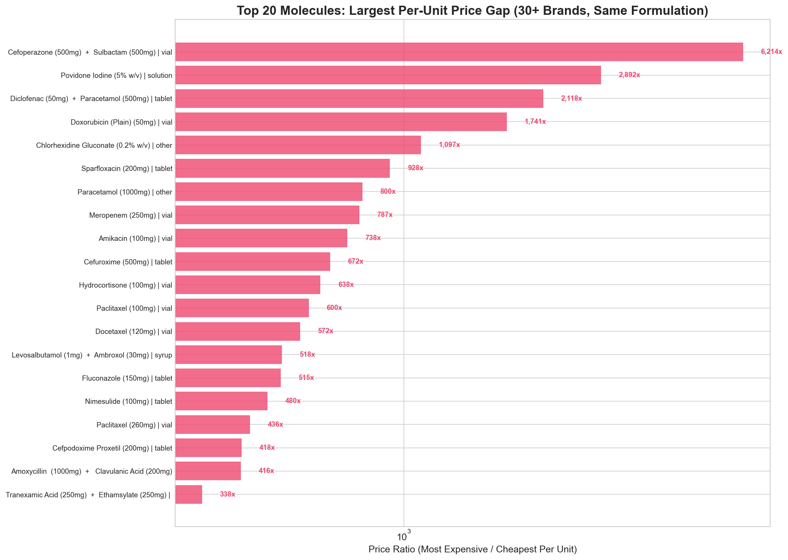
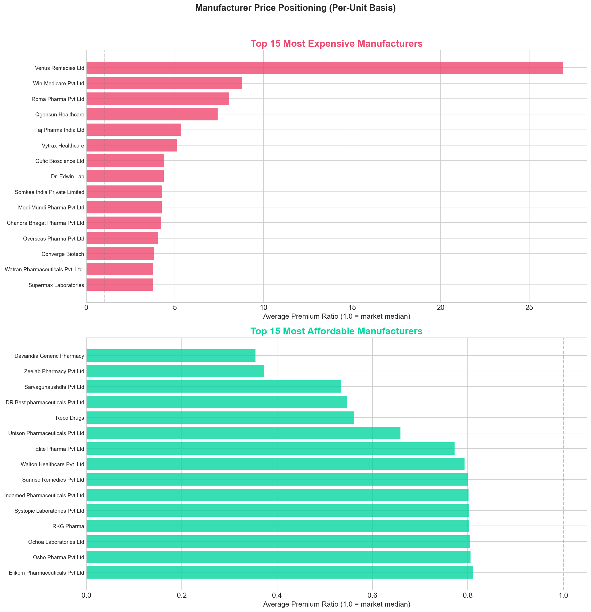
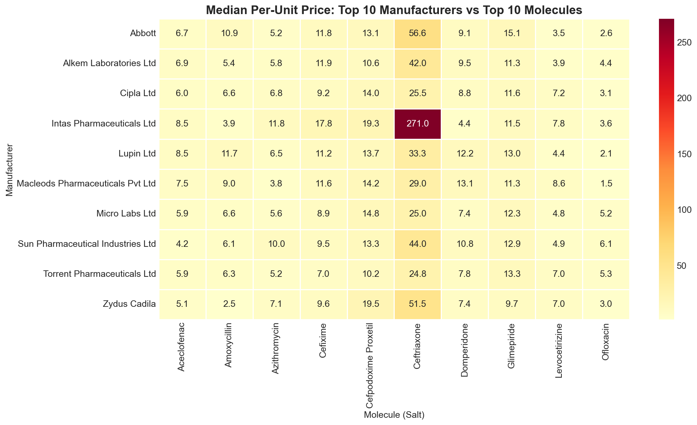

# 💊 India's Medicine Price Gap Analyzer

**If two medicines contain the exact same molecule, why does one cost ₹0.33 and the other ₹23.80?**

An end-to-end analysis of **253,973 Indian medicines** investigating the branded-vs-generic
price gap — from raw data cleaning through Python EDA, **11 analytical SQL queries**, and an
**interactive dashboard** — revealing that **82% of medicines cost 2x+ more per unit** than the
cheapest available alternative.

**▶ [Live interactive dashboard](https://dakshmalhotra256.github.io/Indian-medicines-price-gap-analysis/dashboard/)** — formulation slicer, price-gap, manufacturer, and category views (also a Power BI build; see [`dashboard/DASHBOARD_SPEC.md`](dashboard/DASHBOARD_SPEC.md)).



---

## 🔀 Pipeline

`raw CSV → Python cleaning → SQLite → 11 SQL queries → interactive dashboard`

| Layer | What it does | Where |
|-------|--------------|-------|
| **Data cleaning** | Removes discontinued/invalid rows, extracts pack quantity → `price_per_unit`, formulation type, salt, affordability & premium ratios | [`prepare_data.py`](prepare_data.py) |
| **Python EDA** | 15 charts: distributions, competition paradox, manufacturer premiums, therapy categories | [`India's Medicine Price Gap Analyzer.ipynb`](India's%20Medicine%20Price%20Gap%20Analyzer.ipynb) |
| **SQL analysis** | 11 queries — price gaps, competition bins, manufacturer premiums, category gaps, savings — with CTEs, window logic, and a custom `MEDIAN` aggregate | [`sql/analysis.sql`](sql/analysis.sql) |
| **Dashboard** | 4-page interactive dashboard (+ Power BI spec) | [`dashboard/`](dashboard/) |

---

## 📊 Key Findings

| Finding | Detail |
|---------|--------|
| **Overpricing is the norm** | 82.1% of medicines cost 2x+, 53.3% cost 5x+, and 31.9% cost 10x+ per unit vs the cheapest equivalent |
| **Competition paradox** | More brands = *wider* gaps, not narrower — median gap climbs from **2.6x** (5-10 brands) to **43.7x** (500+ brands) |
| **Most overpriced manufacturer** | Venus Remedies Ltd charges **26.9x** the composition median (139 products) |
| **Most affordable manufacturer** | Davaindia Generic Pharmacy at **0.35x** the median (379 products) |
| **Widest category gaps** | Gastro (8.3x), Vitamin/Supplement (7.9x) and Pain/Fever (6.9x) show the largest median gaps |
| **Most expensive medicine** | A cancer therapy at ₹4,36,000 — investigated, not deleted (real, not a data error) |
| **Actionable savings** | Common molecules (Paracetamol, Metformin, …) carry large per-unit gaps between cheapest and costliest brand |

---

## 🔬 Methodology

This isn't a generic Kaggle EDA — it uses rigorous analytical decisions:

- **Price-per-unit normalization** — Raw MRP is misleading. A ₹100 strip of 10 tablets and a ₹50 strip of 5 have the same per-unit cost. All comparisons use `price_per_unit = price / pack_qty`.
- **Same-formulation comparison** — Prices compared within the same formulation type (tablet vs tablet, not tablet vs injection) via `comp_and_type`.
- **Outlier investigation, not deletion** — Medicines above the 99.9th percentile are flagged (`is_premium_priced`), not dropped. A ₹4.36L cancer drug isn't an error.
- **Combination-drug handling** — ~56% empty `short_composition2` recognized as single-ingredient drugs, not missing data.

---

## 🧮 SQL Analysis (`sql/analysis.sql`)

11 queries run against a SQLite build of the cleaned data:

- Dataset overview by formulation type
- Biggest per-unit price gaps (≥30 brands, ranked by costliest ÷ cheapest)
- The competition paradox (median gap by brand-count bin)
- Affordability (% of medicines 2x / 5x / 10x above the cheapest equivalent)
- Most / least overpriced manufacturers (per-unit premium vs composition median)
- Price gap by therapeutic category
- Most crowded molecules, single vs combination pricing, most expensive medicines
- Switch-and-save analysis for common household molecules

```bash
python prepare_data.py     # raw CSV -> data/medicines_clean.csv
python build_db.py         # -> data/medicines.db (SQLite, indexed)
python run_analysis.py     # run all 11 queries, export dashboard CSVs
```

---

## 📈 Python EDA (15 Charts)

The notebook produces 15 visualizations — price distributions, the competition-vs-gap
relationship, manufacturer × molecule heatmap, therapeutic-category boxplots, the
affordability index, and top-savings tables.




---

## 🗂️ Dataset

The **Indian Medicine Dataset** (253,973 medicines): `id, name, price(₹), Is_discontinued,
manufacturer_name, type, pack_size_label, short_composition1, short_composition2`.

- Source: [junioralive/Indian-Medicine-Dataset](https://github.com/junioralive/Indian-Medicine-Dataset) (also on [Kaggle](https://www.kaggle.com/datasets/shudhanshusingh/az-medicine-dataset-of-india))
- Place the CSV at `data/indian_medicines.csv`, then run the pipeline above.

---

## 🛠️ Tools

- **Python** — Pandas, NumPy, Matplotlib, Seaborn, Regex (cleaning + EDA)
- **SQL (SQLite)** — CTEs, conditional aggregation, custom `MEDIAN` aggregate
- **Dashboard** — self-contained interactive HTML + Power BI spec (DAX)

---

## ⚠️ Limitations

1. **Cross-pack noise** — a few ratios may be inflated where very different pack sizes share a composition; mitigated by same-formulation grouping.
2. **Therapeutic mapping** — a keyword mapping over common molecules; the rest fall in "Other".
3. **No time dimension** — a single price snapshot, so no trend analysis.
4. **Pack-quantity heuristic** — uses the first number in the pack label as the unit count.

---

## 👤 Author

**Daksh Malhotra** — B.Tech Engineering Physics, Delhi Technological University (DTU)

*For educational purposes. Always consult a qualified medical professional before switching medications.*
